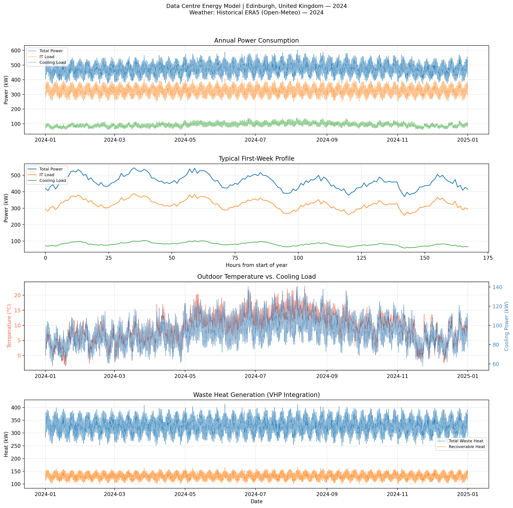

# Data centre Energy Modelling

An open-source physics-based tool for simulating data centre power consumption and waste heat generation, developed as part of Virtual Heat Plant research at the University of Edinburgh.

## What It Does

Generates realistic hourly or half-hourly data centre load profiles and recoverable waste heat profiles (based on real weather data) that can be directly plugged into energy system models, grid simulators, and local area energy planning frameworks without requiring access to proprietary operational data.

The tool is built around the idea that data centres are not just large electricity consumers but also potential heat sources that can play an active role in local energy systems. Waste heat from data centres can offset gas boiler operation in district heating networks, and when combined with signals from renewable energy availability, electricity prices, and carbon emissions, the load profiles can inform smarter switching strategies across heating and power networks.
This makes it useful for a range of research areas, including demand-side flexibility, multi-vector energy network modelling, sector coupling between power and heat, and local authority energy planning, where data centre growth needs to be factored into long-term infrastructure decisions. The domestic heating sector is also in scope, where flexibility from heat pumps and thermal storage can be coordinated alongside data centre waste heat to reduce peak grid demand and carbon emissions.

The goal is to give researchers a realistic, configurable data centre load that slots into their own models rather than having to build one from scratch.

## Example Output



## Features

- Physics-based IT load modelling (daily/weekly patterns)
- Real weather data via Open-Meteo / ERA5 reanalysis (no API key needed)
- Temperature-dependent cooling calculations
- Dynamic PUE (Power Usage Effectiveness) analysis
- Waste heat quantification for district heating
- Outputs to CSV, Excel, and PNG plots

## Installation

```bash
pip install -r requirements.txt
```

## Quick Start

Edit the CONFIG block at the top of `DC_energy_modelling_v2.py`:

```python
CONFIG = {
    "city":             "Edinburgh",
    "year":             2024,
    "timestep_hours":   1,        # 1 = hourly, 0.5 = half-hourly
    "it_capacity_kw":   500,
    "pue":              1.4,
    "base_utilization": 0.65,
    "output_csv":       True,
    "output_excel":     True,
    "output_plots":     True,
    "output_dir":       ".",
}
```

Then run:

```bash
python DC_energy_modelling_v2.py
```

## Requirements

- Python 3.8+
- numpy, pandas, matplotlib, requests, openpyxl

## License

MIT License — see LICENSE file

## Author

Mousa Zerai  
University of Edinburgh
